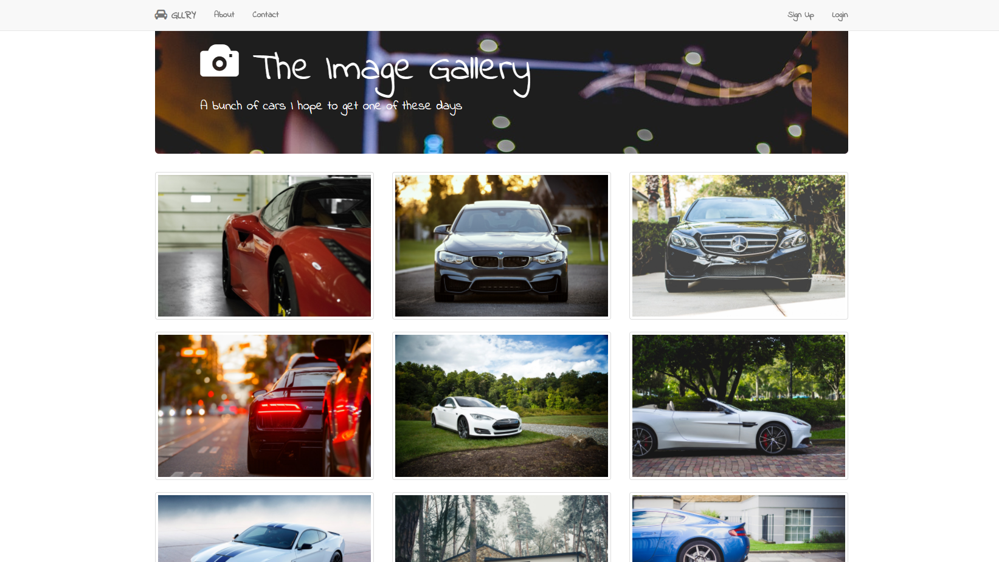
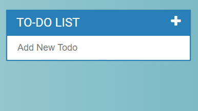
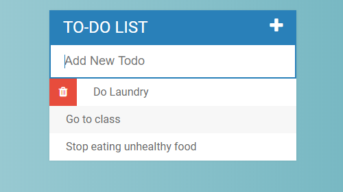
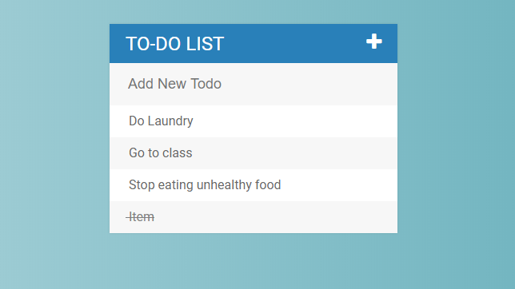
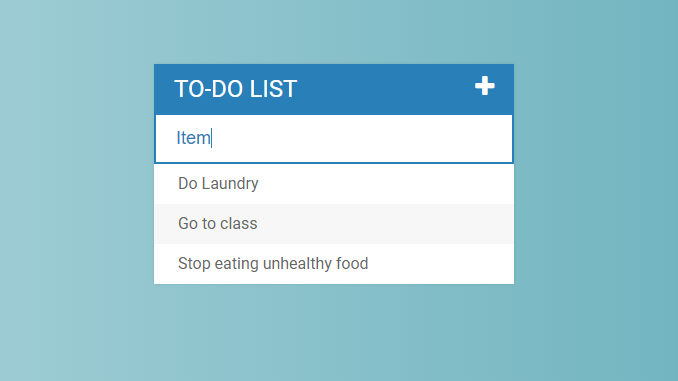
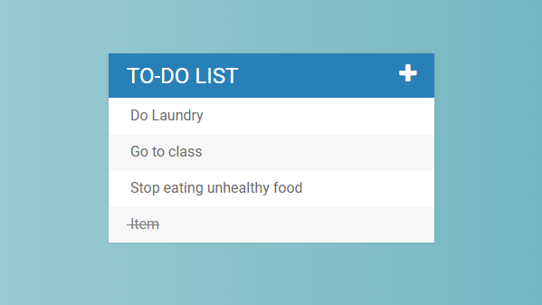
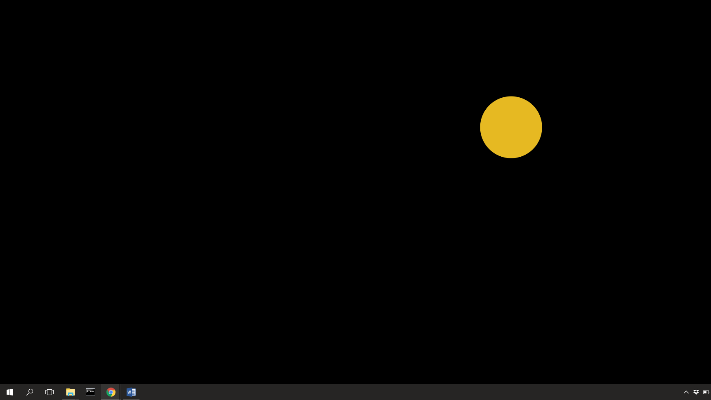

# Web-Development
This is a repository containing some of the HTML, Javascript and CSS code from learning these languages
```
To see what each file does, download the repository and load any html file from its folder into your browser
```
# Gallery
Gallery is just a static site where I practice creating a **navbar** as well as practicing using **bootstrap**


# ToDoList
For the ToDoList, I practice using Javascript to make an interactive ToDo list. 

- **Hover** Over an item on list to reveal the delete button

- **Click** on an item to cross it out or uncross it

- Type anything inside the **Add New Todo** to add to the list then press **enter** 

- Select **plus** logo to hide text box
```
```


# PatClone
This is a Patatap clone. You press a key and using the paperjs library, a circle pops up on the screen and slowly fades away

